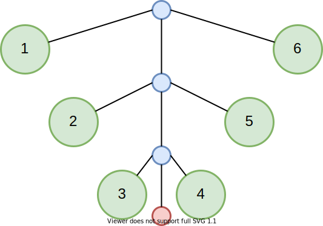
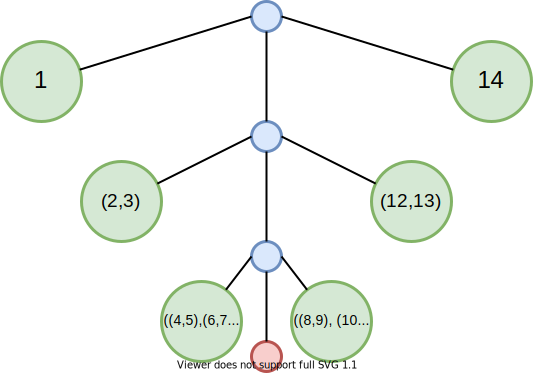
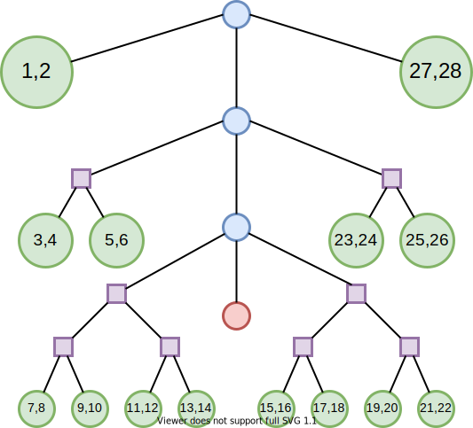
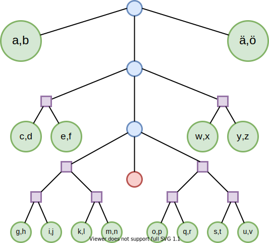

# FingerTrees
An implementation of 2-3 finger trees à la [Hinze &amp; Paterson 2006](https://www.staff.city.ac.uk/~ross/papers/FingerTree.pdf), including several applications.

This project is one part of my Haskell portfolio, which can be found [here](https://github.com/gelijergensen/Haskell-Portfolio).

# Finger Trees as General-Purpose Functional Data Structure

In this section, we present an introduction to some of the theory of 2-3 finger trees.
Ralf Hinze and Ross Paterson [[1]](#References) introduced 2-3 finger trees in 2006 as a purely functional data structure for persistent sequences. 
While previous implementations of purely functional persistent sequences existed (e.g. the catenable deques of Okasaki 1999 [[2]](#References)), 2-3 finger trees have the distinct advantage of being both relatively simple as well as very general.

To better explain the relative simplicity of their definition, let us first discuss a possible recursive description for a queue: a queue is either 
1. empty,
2. just a single element, or
3. a first element, a last element, and a queue of middle elements.

Written in Haskell, this might look something like
```haskell
data Queue a
  = Empty
  | Single a
  | Deep a (Queue a) a
```
and as a diagram we could represent it like this: 
,
where empty nodes are red, `Deep` nodes are blue, and values are green.
While sufficient for some purposes, this implementation has a serious flaw: attempting to push an item onto the front of the queue is actually an `O(n)` operation instead of the expected `O(1)`:
```haskell
cons :: a -> Queue a -> Queue a
cons a Empty = Single a
cons a (Single b) = Deep a Empty b
cons a (Deep f mid r) = Deep a (cons f mid) r
```
Each call to `cons` recurses into the queue containing the middle items, so we will have approximately `n/2` recursive calls before we hit the base case.
One way to improve this structure is to use polymorphic recursion: rather than having the middle queue contain single elements, we can bundle them together into pairs.
```haskell
data Queue a
  = Empty
  | Single a
  | Deep a (Queue (a, a)) a
```
This ensures that the "depth" of the queue is considerably smaller.
At the highest level, we store single elements.
In the second level, we store pairs of elements.
In the third level, we store pairs of pairs of elements.
As such, viewing the queue as a tree shows that the depth of the tree is logarithmic in the number of elements.

Unfortunately, this leads to a problem in the `cons` function: we no longer have an element in the front of the queue!
```haskell
...
cons a (Deep f mid r) = Deep undefined (cons (a, f) mid) r
```
We need a bit more flexibility on the first and last elements of the queue, so we introduce a new data type: a `Digit` which contains either one or two elements
```haskell
data Digit a
  = One a
  | Two a a
```
We call this data type a `Digit` because it is an instance of so-called "numerical representations" (see Okasaki [[2]](#References)); this has no relation to the "finger" in finger trees.
With the new `Digit` data type, we can properly design the much more efficient queue:
```haskell
data Queue a
  = Empty
  | Single a
  | Deep (Digit a) (Queue (a, a)) (Digit a)

cons :: a -> Queue a -> Queue a
cons a Empty = Single a
cons a (Single b) = Deep (One a) Empty (One b)
cons a (Deep (One b) mid r) = Deep (Two a b) mid r
cons a (Deep (Two b c) mid r) = Deep (One a) (cons (b, c) mid) r
```
Notice that the `cons` operation is well-defined and only requires `O(log(n))` operations in the worst case: even if we recurse on every call to `cons`, the depth of the queue is only logarithmic.
In fact, we do considerably better on average, since only every other element which we `cons` onto the front of the queue recurses to the next level.
On average, the complexity is therefore

So the average complexity of this operation is actually `O(1)`, just like we wanted!

The `Queue` structure which we have designed above could be thought of as a sort of 1-2 finger tree: each of the nodes in the tree contains either 1 or 2 elements and we have "pointers" (aka fingers) to the first and last element of the tree.
Putting all the above together, we are ready to present the simplest formulation for 2-3 finger trees:
```haskell
data FingerTree a 
  = Empty
  | Single a
  | Shallow (Digit a)
  | Deep (Digit a) (FingerTree (Node a)) (Digit a)

data Digit a
  = Two a a
  | Three a a a

data Node a
  = Node a a

cons :: a -> FingerTree a -> FingerTree a
cons a Empty = Single a
cons a (Single a) = Shallow (Two a b)
cons a (Shallow (Two b c)) = Shallow (Three a b c)
cons a (Shallow (Three b c d)) = Deep (Two a b) Empty (Two c d)
cons a (Deep (Two b c) mid r) = Deep (Three a b c) mid r
cons a (Deep (Three b c d) mid r) = Deep (Two a b) (cons (Node c d) mid) r
```
Here, the nodes of our tree contain either two or three elements (assuming there are at least two elements in the tree) and, as before, we pack together more and more elements as we go deeper into the tree.
As in the above picture, this might look something like this:

where empty nodes are in red, `Deep` nodes are in blue, `Node` nodes are in purple, and `Digit`s are in green.
From here, we can greatly enhance the functionality of our data structure by putting metadata in the interior nodes of the tree.
Letting `v` be the type of these annotations, the new structure looks something like this:
```haskell
data FingerTree v a
  = Empty
  | Single v a
  | Shallow v (Digit v a)
  | Deep v (Digit v a) (FingerTree v (Node v a)) (Digit v a)

data Digit v a
  = Two v a a
  | Three v a a a

data Node v a
  = Node v a a
```
Thinking generally, the annotations represent some sort of "cached measurement" which is the combined total of the measurements of the elements in the subtree.
To keep track of things, we introduce a new typeclass `Measured` for these measurements.
We require that the measurement values form a monoid, as we wish to be able to combine them.
```haskell
class Monoid v => Measured a v where
  measure :: a -> v
```
Most of the time, we simply define a new type (or use a `newtype` wrapper) for each new kind of measurement.
As an example, we can keep track of the size of the finger tree in constant time by using an `Int` annotation.
```haskell
newtype Size = Size
  { unSize :: Int
  }

instance Monoid Size where
  (Size n) <> (Size m) = Size (n + m)
  mempty = Size 0
```
It is also generally cleaner to wrap the internal elements in a newtype, as that allows us to automatically deduce the necessary `Measured` instances and use smart constructors:
```haskell
newtype Elem a = Elem a

instance Measured (Elem a) Size where
  measure _ = Size 1

instance (Measured a v) => Measured (Digit v a) v where
  measure (Two v _ _) = v
  measure (Three v _ _ _) = v

instance Measured a v => Measured (Node v a) v where
  measure (Node v _ _) = v

instance (Measured a v) => Measured (FingerTree v a) v where
  measure Empty = mempty
  measure (Single v _) = v
  measure (Shallow v _) = v
  measure (Deep v _ _ _) = v

digit2 :: (Measured a v) => a -> a -> Digit v a
digit2 a b = Two (measure a <> measure b) a b

digit3 :: (Measured a v) => a -> a -> Digit v a
digit2 a b c = Three (measure a <> measure b <> measure c) a b c

node :: (Measured a v) => a -> a -> Node v a
node a b = Node (measure a <> measure b) a b

single :: (Measured a v) => a -> FingerTree v a
single a = Single (measure a) a

shallow :: (Measured a v) => Digit v a -> FingerTree v a
shallow x = Shallow (measure x) x

deep ::
  (Measured a v) =>
  Digit a ->
  FingerTree v (Node v a) ->
  Digit a ->
  FingerTree v a
deep f mid r = Deep (measure f <> measure mid <> measure r) f mid r
```
We do need to modify `cons` to use the smart constructors, but otherwise little changes:
```haskell
cons :: (Measured a v) => a -> FingerTree v a -> FingerTree v a
cons a Empty = single a
cons a (Single _ b) = shallow (digit2 a b)
cons a (Shallow _ (Two _ b c)) = shallow (digit3 a b c)
cons a (Shallow _ (Three _ b c d)) = deep (digit2 a b) Empty (digit2 c d)
cons a (Deep _ (Two b c) mid r) = deep (digit3 a b c) mid r
cons a (Deep _ (Three b c d) mid r) = deep (digit2 a b) (cons (node c d) mid) r
```
And for all that refactoring, we are rewarded with a very simple `O(1)` implementation of `size`:
```haskell
size :: FingerTree Size (Elem a) -> Int
size = unSize . measure
```
Best of all, we can easily use any monoid `m` we wish to, as long as we define the `Measured (Elem a) m` instance.
As a freebie, consider adding "labels":
```haskell
newtype Label = Label
  { unLabel :: String
  }

instance Monoid Label where
  mempty = Label ""
  (Label x) <> (Label y) = Label (x ++ y)

instance Show a => Measured (Elem a) Label where
  measure (Elem a) = Label (show a)

label :: FingerTree Label (Elem a) -> String
label xs = "Tree: " ++ unLabel (measure xs)
```
This would give us an `O(1)` method for printing out the contents of the finger tree in order.
For instance, the tree

would have a label of
```haskell
"Tree: abcdefghijklmnopqrstuvwxyzäö"
```

# Finger Trees as Implementations of Data Structures

Here, we briefly describe the application of finger trees to implement 5 different data structures.

## Deques

Finger trees can be easily modified to work as double-ended queues.
As in the introduction above, we use a simple newtype wrapper `Elem` around the elements of the deque and also keep track of the length of the deque using the `Size` monoid:
```haskell
newtype Deque a = Deque (FingerTree Size (Elem a))

newtype Size = Size
  { unSize :: Int
  }

newtype Elem a = Elem
  { unElem :: a
  }

instance Monoid Size where
  mempty = Size 0
  Size x <> Size y = Size (x + y)

instance Measured (Elem a) Size where
  measure _ = Size 1
```
The implementation here offers `O(1)`
* `size`,
* insertion at ends (`<|` or `|>`), and
* `head`, `tail`, `last`, `init`,

`O(log(min(i, n-i)))`
* random access lookups (`lookup i`),
* random access insertion/deletion/modification (`insertAt i`, `deleteAt i`, `modifyAt i`), and
* splitting (`take i`, `drop i`, `splitAt i`),

`O(log(min(n, m)))`
* concatenation of deques,

`O(i)`
* index finding from the left or right end (`findIndexL`, `findIndexR`), and
* spanning from the left or right end (`spanl`, `spanr`),

as well as an assortment of `O(n)` folding, mapping, traversal, and zipping operations.
The `Deque` implemention is even a `Traversable`!

## Sets

Since finger trees are trees under the hood, we can also take advantage of them to implement sets.
To do this, we actually combine two different monoids: `Size` from above, as well as `Last a` which always returns the second argument.
If we maintain the invariant that the finger tree holds elements in ascending order, then `Last a` is actually equivalent to the maximum element in the (sub)tree as serves as "signposts" for quick insertion/deletion which preserves the invariant.
```haskell
data Last a
  = NoLast
  | Last a

data SizeLast a = SizeLast
  { getSize :: Size, 
    getLast :: Last a -- largest element in the set
  }

newtype Set a = Set (FingerTree (SizeLast a) (Elem a))

instance Monoid (Last a) where
  x <> NoLast = x
  _ <> x = x
  mempty = NoLast

instance Monoid (SizeLast a) where
  x <> y =
    SizeLast
      { getSize = getSize x <> getSize y,
        getLast = getLast x <> getLast y
      }
  mempty =
    SizeLast
      { getSize = mempty,
        getLast = mempty
      }

instance Measured (Elem a) (SizeLast a) where
  measure x =
    SizeLast
      { getSize = Common.Size 1,
        getLast = Common.Last $ unElem x
      }
```
The resulting implementation offers `O(1)`
* `size` and
* retrieval of the minimum and maximum elements,

`O(log(min(i, n-i)))`
* retrieval of the ith smallest / largest element and
* insertion, deletion, and membership checking,

`O(m*log(n/m + 1))`
* set-theoretic union, intersection, and difference and
* disjointedness and subset checking,

as well as `O(n)` and `O(n * log(n))` mapping, depending on whether the function preserves the order of the elements.
The `Set` implementation is a `Foldable`, but not a `Functor` (due to the `Ord` constraint).

## Multisets

As a minor modification of the previous section, we can also implement multisets, which are sets which possible contain multiple copies of the same element.
We do this by simply tallying the count of an element along with its value in the finger tree.
This also means we keep track of two different `Size` annotations: one for the number of unique values and one for the total number of values in the tree.
```haskell
data MultiSizeLast a = MultiSizeLast
  { cardinality :: Size, -- sum of all multiplicities
    supportSize :: Size, -- number of unique elements
    getLast :: Last a -- largest element in the multiset
  }

data MultiElem a = MultiElem
  { unMultiElem :: a,
    multiplicity :: Int
  }

newtype MultiSet a = MultiSet (FingerTree (MultiSizeLast a) (MultiElem a))

instance Monoid (MultiSizeLast a) where
  x <> y =
    MultiSizeLast
      { cardinality = cardinality x <> cardinality y,
        supportSize = supportSize x <> supportSize y,
        getLast = getLast x <> getLast y
      }
  mempty =
    MultiSizeLast
      { cardinality = mempty,
        supportSize = mempty,
        getLast = mempty
      }

instance Measured (MultiElem a) (MultiSizeLast a) where
  measure x =
    MultiSizeLast
      { cardinality = Size $ multiplicity x,
        supportSize = Size 1,
        getLast = Last $ unMultiElem x
      }
```
An addition to offering all of the operations of `Set` (with the exception of `member` and `delete`), the implementation offers `O(1)`
* number of unique elements,

`O(log(min(i, n - i)))`
* deletion of a single copy or all copies of an element (`deleteOnce`, `deleteEach`) and
* `count` of an element (instead of `member`),

as well as `O(n)` computation of the `support` of the multiset (i.e. the conversion to a set by forgetting the count of each element).
As with `Set`, the `MultiSet` implementation is a `Foldable`, but not `Functor`.

## Ordered Sequences

A queue can be easily modified into a priority queue.
Ordered sequences priority queues as well as heaps (albeit with slightly different complexities for inserting and min/max retrieval [`O(log(n))` instead of `O(1)` and `O(1)` instead of `O(log(n))`, respectively]).
The underlying structure is remarkably similar for `OrdSeq` and `MultiSet`: rather than treat multiple copies of an element as a single element with a count greater than 1, we simply insert multiple copies of the element.
In actuality, both of these structures could be combined into a single structure.
However, as the interface for these two structures is vastly different (one of them is an unstructured "bag", while the other is a well-defined sequence of elements), we provide different operations for them.
`OrdSeq` uses the same `SizeLast` measure and `Elem` elements as `Set`:
```haskell
newtype OrdSeq a = OrdSeq (FingerTree (SizeLast a) (Elem a))
```
The implementation has similar complexities to `Set`, but provides mostly the same operations as `Deque`, including `O(1)`
* `size` and 
* `head`, `tail`, `last`, `init`,

`O(log(min(i, n-i)))`
* random access lookups (`lookup i`),
* insertion/deletion/modification and
* splitting (`take i`, `drop i`, `splitAt i`),

`O(i)`
* index finding from the left or right end (`findIndexL`, `findIndexR`), and
* spanning from the left or right end (`spanl`, `spanr`),

`O(m*log(n/m + 1))`
* concatenation,

`O(n)` and `O(n * log(n))` mapping, depending on whether the function preserves the order of the elements, as well as a similar assortment of `O(n)` folding and zipping operations.
Due to the `Ord` constraint, `OrdSeq` is only a `Foldable` and not a `Functor` or `Traversable`.

## Interval Trees

# References

[1]: Hinze, Ralf, and Ross Paterson. "Finger trees: a simple general-purpose data structure." Journal of functional programming 16.2 (2006): 197-218.
[2]: Okasaki, Chris. Purely functional data structures. Cambridge University Press, 1999.
